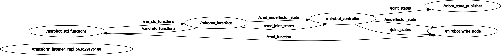

# ROS2-Jazzy Wlkata Mirobot Interface

This project provides a ROS 2 interface for controlling the Wlkata Mirobot robotic arm. It includes nodes for sending G-code commands, subscribing to joint states, and controlling the end effector.

## Features

- **G-code Command Execution**: Send G-code commands to the Mirobot via a serial connection.
- **Joint State Subscription**: Subscribe to joint states and convert them into G-code commands.
- **End Effector Control**: Control the state of the end effector using custom messages.
- **Homing Functionality**: Perform homing operations to initialize the robot.
- **Graphical User Interface (GUI)**: The `mirobot_interfaces` package includes a user-friendly GUI for controlling the Mirobot. The GUI allows users to:
  - Send G-code commands directly.
  - Monitor the robot's joint states in real-time.
  - Control the end effector with intuitive buttons.
  - Perform homing operations with a single click.

## Compatibility

This repository is specifically designed to work with **ROS 2 Jazzy** and is not compatible with other versions of ROS 2. Please ensure that you are using the correct ROS 2 distribution to avoid compatibility issues.

## Installation

1. Clone the repository:
   ```bash
   git clone https://github.com/Eagle-Creative/ROS2-Jazzy-Mirobot-Interface.git
   ```

2. Install the `serial_driver` package:
   ```bash
   sudo apt update
   sudo apt install ros-jazzy-serial-driver
   ```

3. Install additional dependencies:
   ```bash
   sudo apt install python3-colcon-common-extensions
   sudo apt install ros-jazzy-rviz2
   sudo apt install ros-jazzy-ros2launch
   ```

4. Build the workspace:
   ```bash
   colcon build
   ```

5. Source the setup file:
   ```bash
   source install/setup.bash
   ```

6. Make the necessary scripts executable:
   ```bash
   chmod +x src/mirobot_interfaces/launch/mirobot_interfaces.launch.py
   ```

## Usage

### Launching the Mirobot Interface

To launch the Mirobot Interface and visualization in RViz, run:
```bash
ros2 launch mirobot_interfaces mirobot_interfaces.launch.py
```

## Dependencies

This project depends on the following ROS 2 packages:

- `rclcpp`
- `sensor_msgs`
- `std_msgs`
- `serial_driver`
- `rosidl_default_generators`

## Custom Messages

The project defines a custom message, `EndeffectorState`, in the `mirobot_msgs` package. This message is used to control the state of the end effector.

## Module Descriptions

### `mirobot_gui`
This module provides the graphical user interface (GUI) for controlling the Mirobot. It includes features such as:
- Sending G-code commands directly to the robot.
- Monitoring joint states in real-time.
- Controlling the end effector with intuitive buttons.
- Performing homing operations with a single click.

### `mirobot_controller`
This module handles the communication between the GUI and the robot. It:
- Subscribes to commands from the GUI.
- Publishes joint states and end effector states to relevant topics.
- Ensures smooth operation of the robot by managing state updates.

### `mirobot_std_functions`
This module provides standard functions for the Mirobot, such as:
- Homing the robot to its initial position.
- Sending predefined G-code commands for common operations.

### `mirobot_gcode_writer`
This module is responsible for translating high-level commands into G-code instructions that the Mirobot can execute. It ensures accurate and efficient communication with the robot's firmware.

## Module Interaction Diagram

Below is a graphical representation of how the modules in this project interact with each other:



## Future Plans

This repository is planned to expand its functionality to provide more advanced control and usage examples for the Wlkata Mirobot. Below are the key areas of development:

1. **Support for Target Coordinate Inputs**:
   - Extend the current interface to allow users to input target coordinates directly.
   - Implement inverse kinematics (IK) calculations to convert target coordinates into joint states.
   - Provide a seamless integration for both joint state and coordinate-based control.

2. **MoveIt Integration**:
   - Add support for MoveIt to enable advanced motion planning and collision avoidance.
   - Create a MoveIt configuration package for the Mirobot.
   - Provide example scripts demonstrating how to use MoveIt for planning and executing trajectories.

3. **Example Scripts**:
   - Include example scripts showcasing various use cases:
     - Basic joint state control.
     - Target coordinate-based control.
     - MoveIt-based motion planning and execution.
   - Ensure the examples are well-documented and easy to follow for new users.

4. **Enhanced GUI Features**:
   - Update the GUI to support target coordinate inputs.
   - Add visual feedback for planned trajectories and robot state.

5. **Documentation and Tutorials**:
   - Expand the documentation to include detailed tutorials for new features.
   - Provide step-by-step guides for setting up and using the new functionalities.

These enhancements aim to make the repository a comprehensive solution for controlling and experimenting with the Wlkata Mirobot in a ROS 2 environment.

## License

This project is licensed under the Apache License 2.0. See the [LICENSE](LICENSE) file for details.

## Contributing

Contributions are welcome! Please follow the standard GitHub workflow:

1. Fork the repository.
2. Create a new branch for your feature or bug fix.
3. Submit a pull request with a detailed description of your changes.

## Acknowledgments

This project is inspired by the Wlkata Mirobot and aims to provide a robust ROS 2 interface for its control.

Additionally, this repository is loosly based on the work from [kimsooyoung/mirobot_ros2](https://github.com/kimsooyoung/mirobot_ros2). Significant updates have been made to replace the `serial` package with the `serial_driver` package because the original package is not supported in ROS2-Jazzy.
